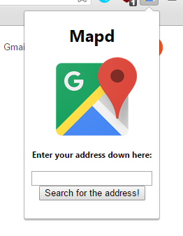

		

 Mapd is a google chrome extension created to make searching of addresses easier and faster. Version 1.0 (current), takes a user inputted address and opens a google maps of the address in a new tab. Mapd is still being worked on to create a nicer UI while adding more functionality. Mapd was created using JavaScript, HTML and JSON. 

The source code can be viewed<a class = "qgeclink" href = "https://github.com/jashansudan/Mapd"><strong> here! </strong></a>

