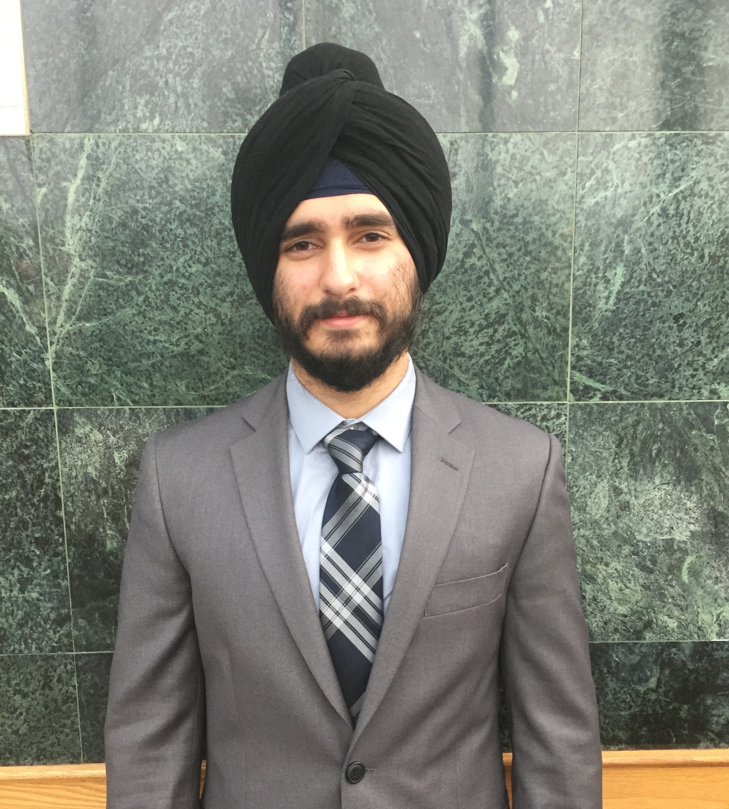


	


<!-- /.tiles -->

	

		
	

	

		
 <b> Hi </b>, my name is <b> Jashandeep Sudan</b>, Jashan for short. 
		I study <b> Computing at Queen's University</b> (Class of 2017), with a specialization in <b> Computer Science.</b>
		I've played on computers since I was a kid, and now I have the pleasure to
		work with them all the time!
		

		

		A few things I like to do in my free time include; weightlifting, skiing, golfing, eating, cooking and most recently drawing!
		

		

		Anyways, thank you for stopping by my site, take a look around and throw me
		some feedback on how I could improve anything.
		

		

		<b>      -Jashandeep Sudan</b>
		

		

			If you want to contact me, or see some of my work, look below!
		

		

			
			
			
		

	

